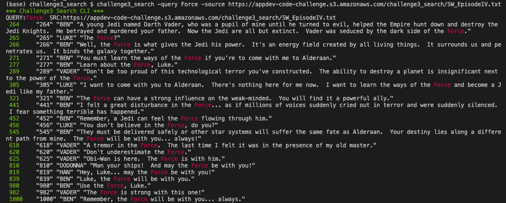

# CodeChallenge3 - Search

CLI text search (case sensitive) written in GO.  Currently only reads a remote URL and prints to CLI.



## Usage

### Development

```
go run challenge3_search.go -query Force -source https://appdev-code-challenge.s3.amazonaws.com/challenge3_search/SW_EpisodeIV.txt

go run challenge3_search.go -h
```

### Installed

`go install` will place the binary at `$GOPATH/bin/`, and if this is on your terminal's `PATH`, it can be invoked directly.
```
go install

challenge3_search -query Force -source https://appdev-code-challenge.s3.amazonaws.com/challenge3_search/SW_EpisodeIV.txt
challenge3_search -query Force -source https://appdev-code-challenge.s3.amazonaws.com/challenge3_search/SW_EpisodeV.txt
challenge3_search -query Force -source https://appdev-code-challenge.s3.amazonaws.com/challenge3_search/SW_EpisodeVI.txt
```

## Things I Learned

- padding when printing to CLI, `fmt.Printf(" %-7v ", fmt.Sprint(index))`
- GO slices `[]string vs. [3]string`, very important distinction.  Slices are memory flexible, and centered around the pointer instead of copying an entire array of data.  Read [here](https://medium.com/@marty.stepien/arrays-vs-slices-bonanza-in-golang-fa8d32cd2b7c) for more.
- iterate over an array: `for _, line := range stringArr {`
- GO `defer`, A defer statement defers the execution of a function until the surrounding function returns
- `flags.String(name, default, help msg)`, usefulf or CLI parameters, good [link](https://gobyexample.com/command-line-flags)
- `go mod init (package name)`, 
  - for this project `go mod init github.com/yamori/challenge3_search`
  - where `challenge3_search` is the name of the entry file, convention
- `go install`
  - executed locally will install to `$GOPATH/bin/`, and if this is on `PATH` it can then be used immediately
- dependencies: `go get github.com/gookit/color` will add to `go.mod` automatically
- VSCode - go extensions, auto complete etc.